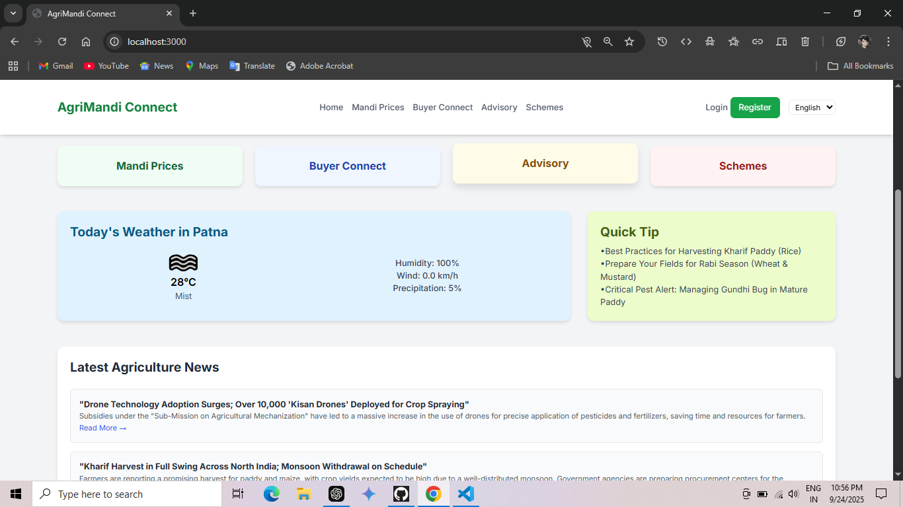
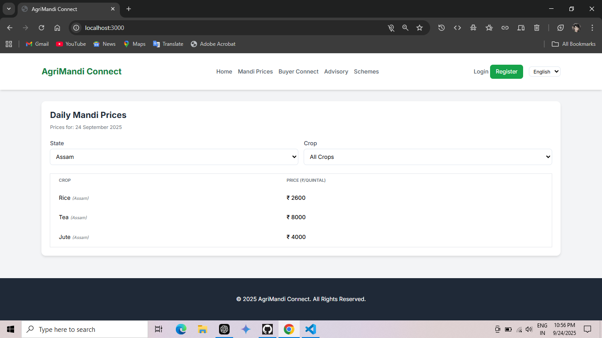
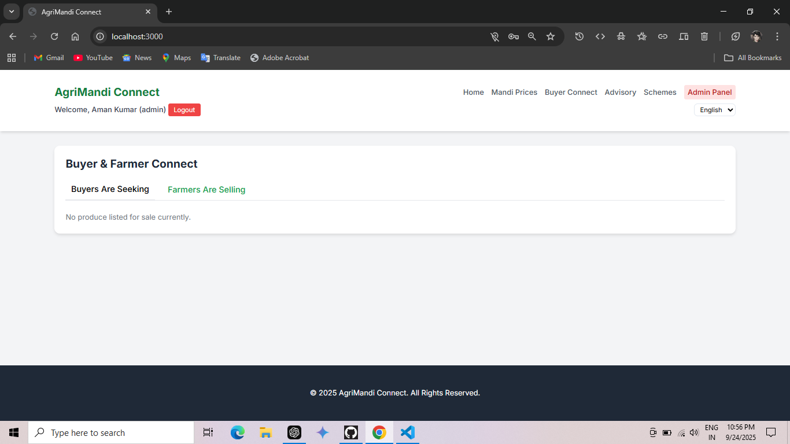
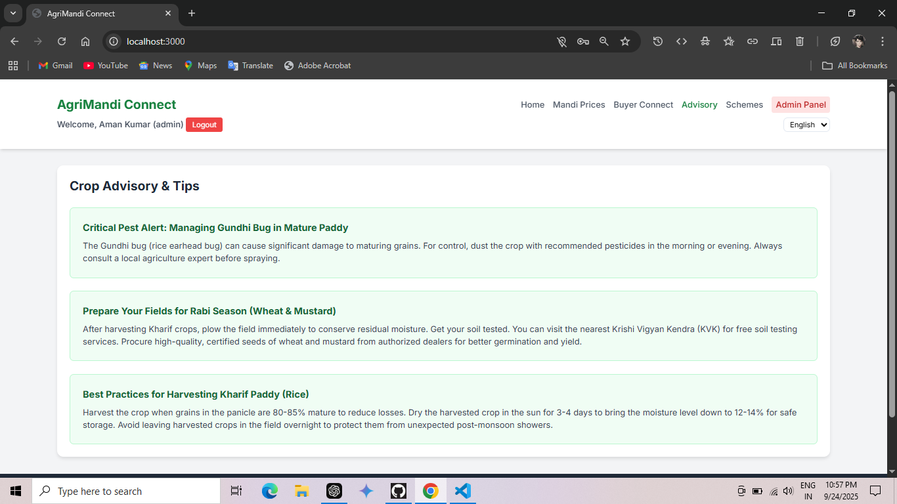
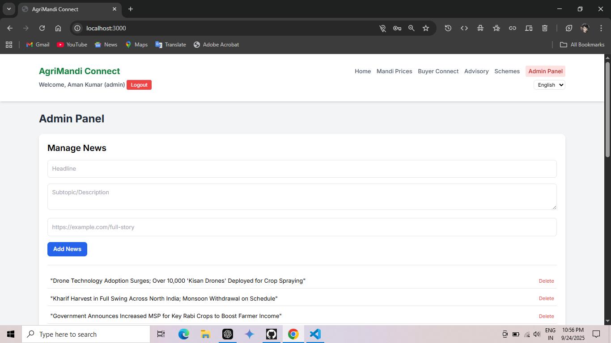

# 🌾 AgriMandi Project

AgriMandi is a web-based platform designed to connect **farmers, buyers, and administrators** in a digital marketplace.  
It helps streamline crop listing, buyer requests, and mandi administration, making agriculture trading more transparent and accessible.

---

## ✨ Features

- 👨‍🌾 **Farmer Module** – Farmers can register, list their crops, and track buyer requests.
- 🛒 **Buyer Module** – Buyers can request crops, connect with farmers, and track status.
- 🛠 **Admin Panel** – Manage users, verify requests, and oversee marketplace activities.
- 🔒 **Authentication** – Secure login for farmers, buyers, and admin roles.
- 📊 **Dashboard** – Overview of crops, prices, and transaction requests.

---

## 🛠 Tech Stack

- **Frontend:** HTML, CSS, JavaScript  
- **Backend:** Node.js, Express.js  
- **Database:** MongoDB  
- **Authentication:** JWT (JSON Web Token)  
- **Other Tools:** Git, GitHub

---

## 🚀 Installation & Setup

1. Clone the repository:
   ```bash
   git clone https://github.com/Aman-20/Agrimandi-Project.git
   cd Agrimandi-Project

2. Install dependencies:
   npm install

3. Create a .env file and add:
   MONGO_URI=your_mongodb_connection_string
   JWT_SECRET=your_secret_key
   PORT=5000

4. Start the server:
   node server.js

5. Visit the app
   http://localhost:5000


## 📸 Screenshots

### Home Page


### Mandi Price


### Buyer Connect


### Advisory


### Schemes


### Admin Panel



Agrimandi-Project/
│-- screenshots/          
│-- .env/          # environment variables
│-- index.html/            # html,css,js
│-- package-lock.json/           
│-- package.json      
│-- README.md          # Project documentation
│-- server.js          # Express backend code


Contributions are welcome!
 • Fork the repo
 • Create a new branch (feature-xyz)
 • Commit changes
 • Open a pull request


👨‍💻 Author
 • Aman

